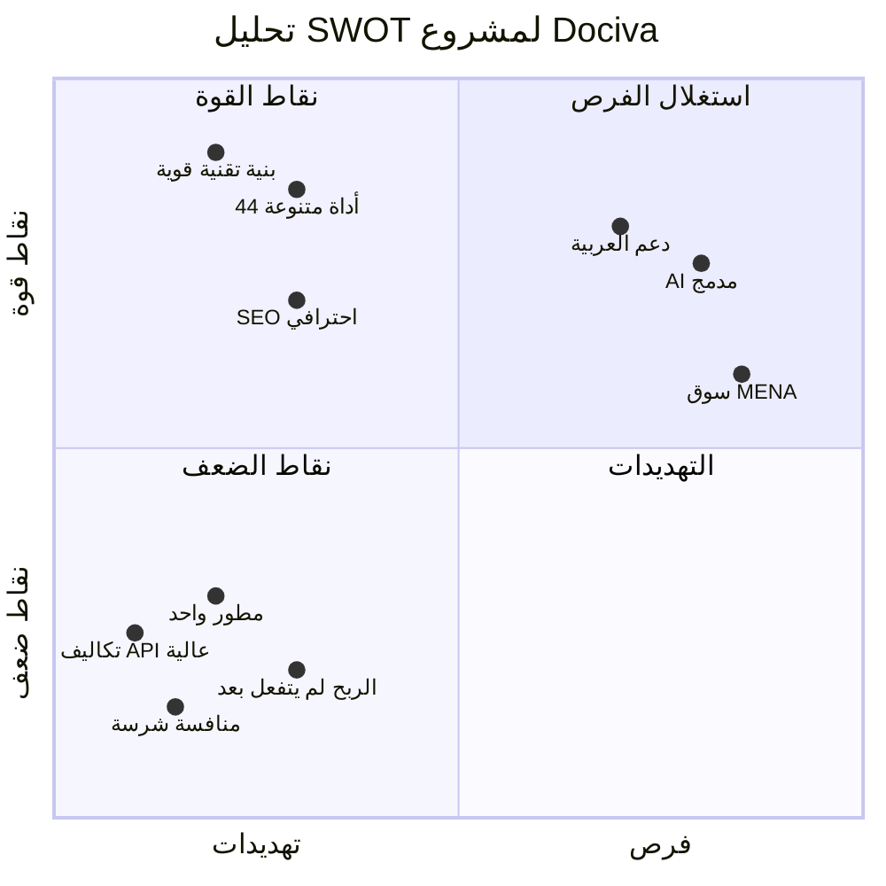

# 🔍 تقييم شامل لمشروع Dociva — dociva.io

**المُقيّم:** Antigravity AI — بمنظور مزدوج: مبرمج أول + مدير إقليمي للشركات الصغيرة والمتوسطة  
**التاريخ:** 23 أبريل 2026  
**المشروع:** Dociva — منصة أدوات معالجة الملفات المجانية عبر الإنترنت  
**الرابط:** [dociva.io](https://dociva.io)

---

## 📊 ملخص تنفيذي

| الجانب | التقييم | الدرجة |
|--------|---------|--------|
| البنية التقنية (Architecture) | ممتاز | ⭐⭐⭐⭐½ |
| جودة الكود | جيد جداً مع ملاحظات | ⭐⭐⭐⭐ |
| تغطية الأدوات (Features) | ممتاز ومبهر | ⭐⭐⭐⭐⭐ |
| الأمان (Security) | جيد جداً | ⭐⭐⭐⭐ |
| SEO والتسويق الرقمي | ممتاز | ⭐⭐⭐⭐⭐ |
| نموذج الربح (Monetization) | في البداية — يحتاج تطوير | ⭐⭐⭐ |
| DevOps والنشر | ممتاز | ⭐⭐⭐⭐⭐ |
| الاختبارات (Testing) | جيد جداً | ⭐⭐⭐⭐ |
| قابلية التوسع (Scalability) | جيدة مع تحفظات | ⭐⭐⭐½ |
| تجربة المستخدم (UX) | جيدة جداً | ⭐⭐⭐⭐ |
| **التقييم العام** | **مشروع قوي وجاد** | **⭐⭐⭐⭐** |

---

## الجزء الأول: التقييم التقني (منظور المبرمج)

### 1. ✅ البنية التقنية — Architecture

> [!TIP]
> هذا من أقوى جوانب المشروع. البنية ناضجة وتدل على خبرة حقيقية.

**ما يميز المشروع:**

- **فصل واضح بين الطبقات:** Backend (Flask) ↔ Frontend (React) ↔ Task Queue (Celery) — كل طبقة مستقلة
- **نمط Service Layer محترف:** 46 خدمة متخصصة في `backend/app/services/` — كل خدمة مسؤولة عن مجال واحد
- **Task Queue مُصمم بذكاء:** Celery مع 8 طوابير متخصصة (`convert`, `compress`, `image`, `video`, `pdf_tools`, `flowchart`, `ai_heavy`, `default`) — هذا يعني إمكانية تخصيص workers حسب الحمل
- **Docker-first approach:** بيئة تطوير وإنتاج منفصلة تماماً (`docker-compose.yml` vs `docker-compose.prod.yml`)
- **App Factory Pattern:** استخدام `create_app()` مع دعم config_overrides — ممتاز للاختبارات

**الأدوات المدعومة (44 أداة على الواجهة):**

```
PDF: تحويل، ضغط، دمج، تقسيم، تدوير، ترقيم، علامة مائية، حماية، فتح القفل،
     قص، تسوية، إصلاح، تعديل، استخراج صفحات، إعادة ترتيب، بيانات وصفية،
     إزالة علامة مائية، توقيع، PDF↔Word، PDF↔Excel، PDF↔PowerPoint،
     PDF↔صور، HTML→PDF
صور: تحويل، تغيير حجم، قص، تدوير، ضغط، إزالة خلفية، SVG
فيديو: فيديو→GIF
نص: عداد كلمات، منظف نصوص
AI: محادثة مع PDF، تلخيص PDF، ترجمة PDF، استخراج مخططات انسيابية
أخرى: باركود، QR Code، OCR
```

> [!IMPORTANT]
> 44 أداة على الواجهة مع 46 خدمة في الخلفية — هذا حجم عمل ضخم لمطور واحد أو فريق صغير. يستحق الاحترام.

---

### 2. 🔐 الأمان — Security

**الإيجابيات:**
- ✅ CSRF Protection مخصص (ليس مجرد مكتبة — بل تطبيق يدوي ذكي)
- ✅ Flask-Talisman مع Content Security Policy مفصّل ومُعد بعناية للـ AdSense
- ✅ Flask-Limiter لمنع إساءة الاستخدام (Rate Limiting)
- ✅ Flask-CORS مع `supports_credentials=True`
- ✅ HTTPS مع Let's Encrypt (Certbot)
- ✅ Sentry للمراقبة الأمنية والأخطاء
- ✅ التحقق من نوع الملف قبل المعالجة

**ملاحظات يجب الانتباه لها:**

> [!WARNING]
> - كلمة مرور PostgreSQL الافتراضية في `docker-compose.yml` ظاهرة بوضوح (`6x3PjV4ghRTQuZ3Q`) — حتى لو هي للتطوير، وجودها في الكود المنشور يُعتبر مخاطرة
> - ملف `.env` موجود في المستودع (يجب التأكد أنه في `.gitignore`)
> - `'unsafe-inline'` في CSP للـ scripts و styles — ضروري لـ AdSense لكنه يقلل الحماية

---

### 3. 📁 جودة الكود — Code Quality

**الإيجابيات:**
- هيكلة واضحة: `routes/` → `services/` → `tasks/` — كل طبقة لها دور
- TypeScript في الواجهة — نوع البيانات مُحدد
- Design System منفصل في `frontend/src/design-system/`
- State Management مع Zustand (خفيف وعملي)
- i18n مع 4 لغات (عربي، إنجليزي، فرنسي، إسباني) — ملفات ترجمة ضخمة (170KB للعربية!)

**ملاحظات فنية:**

| الملاحظة | التفصيل | الأثر |
|----------|---------|-------|
| تكرار `pytest` في requirements.txt | سطر 76 وسطر 78 — تعريفان مختلفان | مشكلة بسيطة |
| سطر 85 في requirements.txt | تعليق ملتصق بـ package (`# AI Integration google-generativeai`) | خطأ تنسيقي |
| `InternalAdminPage.tsx` = 99KB | ملف واحد بهذا الحجم يصعب صيانته | يحتاج تقسيم |
| `AccountPage.tsx` = 45KB | كبير جداً لمكون واحد | يحتاج تقسيم |
| `api.ts` = 34KB | خدمة واحدة لكل الـ API | يحتاج تقسيم |
| ملفات اختبار/لوغ في backend/ | `pytest_*.log`, `test_*.txt` — 10+ ملفات | يجب تنظيفها من المستودع |

---

### 4. 🧪 الاختبارات — Testing

**الإيجابيات:**
- **58 ملف اختبار** في `backend/tests/` — تغطية واسعة
- اختبارات تشمل: Routes, Services, Tasks, Validators, Security
- استخدام `conftest.py` مع fixtures مشتركة
- اختبار للـ Load Testing (`test_load.py`)
- استخدام `fakeredis` و `requests-mock` — ممارسات احترافية
- اختبارات Frontend مع Vitest + Testing Library + MSW

> [!NOTE]
> مستوى التغطية بالاختبارات مُبهر لمشروع بهذا الحجم. معظم المشاريع المماثلة لا تحتوي حتى على نصف هذا العدد.

---

### 5. 🚀 DevOps والنشر

**ممتاز بكل المقاييس:**
- ✅ Docker multi-stage builds (development/build/production targets)
- ✅ Docker Compose للتطوير والإنتاج
- ✅ Nginx كـ reverse proxy مع 3 ملفات تكوين (عام، تطوير، إنتاج)
- ✅ Celery Beat للمهام المجدولة (تنظيف الملفات المنتهية كل 30 دقيقة)
- ✅ SSL/TLS تلقائي مع Certbot
- ✅ Health checks لجميع الخدمات
- ✅ Deploy script (`scripts/deploy.sh`) مع IndexNow auto-submit
- ✅ Self-hosted Git مع Gitea (استقلالية عن GitHub)
- ✅ AWS S3 + CloudFront للتخزين والتوزيع

---

### 6. 🔍 SEO والتسويق الرقمي

**مستوى احترافي عالي:**
- ✅ Open Graph tags كاملة (Facebook, Twitter)
- ✅ Canonical URLs
- ✅ Structured Data / Schema markup
- ✅ IndexNow integration (Bing) مع إدارة حالة ذكية
- ✅ Sitemap generator ديناميكي
- ✅ Google Site Verification + Bing Verification
- ✅ SEO shells pre-rendered (`render-seo-shells.mjs`)
- ✅ Keyword portfolio builder (`build_keyword_portfolio.py` — 43KB!)
- ✅ صفحات SEO مخصصة (`SeoPage.tsx`, `SeoCollectionPage.tsx`, `SeoRoutePage.tsx`)
- ✅ i18n-aware SEO (محتوى مترجم للعربية والفرنسية والإسبانية)
- ✅ DNS Prefetch + Preconnect + Preload للأداء
- ✅ PWA manifest + Service Worker مع Workbox

> [!TIP]
> الاستثمار في SEO هنا من أفضل ما رأيت في مشاريع بهذا الحجم. هذا يدل على فهم عميق أن الأدوات المجانية تعتمد على حركة البحث العضوي.

---

### 7. 📈 المراقبة والتحليلات — Monitoring & Analytics

مجموعة شاملة:
- **Sentry** — مراقبة الأخطاء في الوقت الفعلي (Backend + Frontend)
- **Google Analytics 4** — تتبع الزوار
- **Microsoft Clarity** — خرائط حرارية وتسجيل الجلسات
- **Plausible Analytics** — بديل مفتوح المصدر يحترم الخصوصية
- **Celery Flower** — مراقبة المهام غير المتزامنة

---

## الجزء الثاني: التقييم التجاري (منظور المدير الإقليمي)

### 8. 💰 نموذج الربح — Revenue Model

**الوضع الحالي:**

| مصدر الدخل | الحالة | الملاحظة |
|------------|--------|----------|
| Google AdSense | ✅ مُفعّل | إعلانات على صفحات النتائج والتحميل |
| Stripe | ✅ مُدمج | بوابة دفع جاهزة |
| PayPal | ✅ مُدمج | بوابة دفع بديلة |
| نظام الائتمان (Credits) | ✅ مبني | `credit_service.py` + `credit_config.py` |
| نظام الحصص (Quotas) | ✅ مبني | `quota_service.py` (15KB) |
| ميزانية الضيوف | ✅ مبني | `guest_budget_service.py` |
| اشتراكات (Subscriptions) | 🔄 مخطط | "Freemium (next phase)" |

> [!IMPORTANT]
> **التحليل:** البنية التحتية للربح موجودة بالكامل (Stripe + PayPal + Credits + Quotas)، لكن يبدو أن التفعيل الفعلي لم يكتمل بعد. المشروع حالياً يعتمد بشكل أساسي على AdSense — وهذا لن يكون كافياً لتحقيق ربحية مستدامة مع تكاليف الخوادم والـ API.

**توصيات الربح العاجلة:**

1. **تفعيل نموذج Freemium فوراً:**
   - مجاني: 3-5 عمليات يومياً بحدود حجم صغيرة
   - Pro ($9-15/شهر): عمليات غير محدودة، بدون إعلانات، حدود حجم أعلى، أولوية في المعالجة
   - Business ($29-49/شهر): API access، معالجة دُفعات، دعم أولوية

2. **أدوات الـ AI يجب أن تكون مدفوعة بالكامل:**
   - ترجمة PDF، محادثة مع PDF، تلخيص PDF — هذه تكلفتها عالية (Google Gemini API)
   - استخدام نظام الائتمان الموجود فعلاً

3. **Pay-per-use للملفات الكبيرة:**
   - أي ملف فوق 5MB → يتطلب حساباً أو دفعاً

---

### 9. 🏢 التموضع في السوق — Market Positioning

**المنافسون المباشرون:**

| المنافس | نقاط القوة | نقطة ضعفه |
|---------|-----------|-----------|
| iLovePDF | علامة تجارية قوية، UX ممتاز | مدفوع بشكل كبير |
| Smallpdf | تصميم أنيق، سهولة الاستخدام | أسعار مرتفعة |
| PDF24 | مجاني بالكامل | تصميم قديم |
| Sejda | أدوات متقدمة | واجهة معقدة |

**أين يقع Dociva؟**

- ✅ **ميزة تنافسية أولى:** دعم اللغة العربية مع RTL — غائب تقريباً عند جميع المنافسين
- ✅ **ميزة تنافسية ثانية:** أدوات AI مدمجة (ترجمة PDF، محادثة مع PDF) — حديث جداً
- ✅ **ميزة تنافسية ثالثة:** 4 لغات (عربي، إنجليزي، فرنسي، إسباني) — يغطي شريحة واسعة
- ✅ **ميزة تنافسية رابعة:** Flowchart من PDF — أداة فريدة نادرة جداً
- ⚠️ **تحدي:** العلامة التجارية جديدة — تحتاج وقت لبناء الثقة

---

### 10. 🎯 تحليل SWOT



**نقاط القوة:**
- بنية تقنية ناضجة ومحترفة
- 44 أداة تغطي احتياجات واسعة
- دعم اللغة العربية + RTL (ميزة نادرة)
- SEO مُحسّن بشكل استثنائي
- أدوات AI حديثة ومبتكرة

**نقاط الضعف:**
- الربح لم يُفعّل بالكامل بعد
- يبدو أن المشروع يُدار بواسطة مطور واحد (خطر Bus Factor)
- بعض الملفات كبيرة جداً وتحتاج إعادة هيكلة
- لا يوجد ORM (التعامل مع قاعدة البيانات يدوي)

**الفرص:**
- سوق MENA ناقص الخدمة في هذا المجال
- أدوات AI في معالجة المستندات في بدايتها
- الفرنسية والإسبانية تفتح أسواق أفريقيا وأمريكا اللاتينية
- API as a Service — مصدر دخل كبير محتمل

**التهديدات:**
- منافسون كبار بميزانيات ضخمة (iLovePDF, Adobe)
- تكاليف API للذكاء الاصطناعي مرتفعة ومتغيرة
- الاعتماد على AdSense وحده غير مستدام

---

### 11. 📋 خطة العمل المقترحة — الأشهر الثلاثة القادمة

#### الشهر الأول: تثبيت الربح 💰
- [ ] تفعيل نموذج Freemium (مجاني محدود + Pro مدفوع)
- [ ] تفعيل Stripe/PayPal للاشتراكات الشهرية
- [ ] جعل أدوات AI مدفوعة فقط (أو بائتمان محدود للمجانيين)
- [ ] إضافة صفحة تسعير واضحة ومقنعة (الموجودة تحتاج تطوير)

#### الشهر الثاني: تحسين الجودة 🔧
- [ ] تقسيم الملفات الكبيرة (`InternalAdminPage.tsx`, `AccountPage.tsx`, `api.ts`)
- [ ] تنظيف ملفات اللوغ والاختبار من المستودع
- [ ] إزالة كلمات المرور الافتراضية من Docker Compose
- [ ] إضافة ORM (SQLAlchemy) بدل SQL المباشر
- [ ] إضافة CI/CD pipeline (GitHub Actions)

#### الشهر الثالث: النمو 📈
- [ ] إطلاق API for Developers (كما تشير صفحة `DevelopersPage.tsx`)
- [ ] حملة SEO مكثفة للكلمات المفتاحية العربية
- [ ] إضافة أدوات جديدة بناءً على طلب المستخدمين
- [ ] بناء مجتمع (Blog محتوى + Social Media)

---

## الجزء الثالث: الرأي الصريح

### من منظور المبرمج 👨‍💻

يا أحمد، أنا أقولها بصراحة: **هذا المشروع مبهر تقنياً.**

ما بنيته هنا ليس مجرد "مشروع جانبي" — هذا منتج حقيقي بمعايير إنتاج عالية. الـ 44 أداة مع Task Queue مُقسّم بذكاء، واختبارات شاملة (58 ملف)، ونظام SEO متقدم... هذا عمل يستحق فريقاً من 3-5 مطورين.

**لكن بصراحة أيضاً:** الكود يحتاج بعض التنظيف. ملفات مثل `InternalAdminPage.tsx` (99KB!) و `api.ts` (34KB) هي "ديون تقنية" ستبطئك لاحقاً. خذ وقتاً لتقسيمها الآن قبل أن تكبر أكثر.

### من منظور مدير الشركات الصغيرة والمتوسطة 💼

**المشكلة الأولى والوحيدة الحقيقية: أين الفلوس؟**

عندك بوابات دفع جاهزة (Stripe + PayPal)، ونظام ائتمان مبني، ونظام حصص مبني — لكن كل هذا لا قيمة له إذا المستخدم لا يُطلب منه الدفع أبداً.

AdSense وحده لن يدفع فاتورة AWS + API costs. أنت تحتاج **اليوم وليس غداً** أن:
1. تحدد أي أدوات مجانية وأيها مدفوعة
2. تُفعّل صفحة التسعير
3. تبدأ بتحصيل إيرادات حقيقية

**الخبر الجيد:** البنية التحتية جاهزة. أنت لا تحتاج بناء شيء من الصفر — فقط تفعيل ما بنيته فعلاً.

### الخلاصة النهائية

> [!IMPORTANT]
> **Dociva مشروع من الدرجة الأولى تقنياً، لكنه في مرحلة "ما قبل الربح". المطلوب الآن ليس مزيداً من الأدوات — بل تفعيل المحرك التجاري الذي بنيته بالفعل.**

**تقييمي النهائي: 8/10** — مع إمكانية الوصول لـ 9.5/10 خلال 3 أشهر إذا اتبعت خطة العمل أعلاه.

---

> **ملاحظة:** هذا التقييم مبني على فحص شامل للكود المصدري (Backend + Frontend + DevOps + Config) والموقع المنشور على dociva.io. لم يتم كتابة أي كود كما طلبت.
